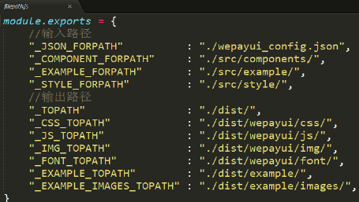

# 架构组织

### 兼容
Crosswalk是个好东西，缺陷是打包后会很大(增20m左右)。

### 工程组织
1. 分文件夹管理子模块
2. 深层次使用gulp，进一步自动化解决人工维护痛点，此外，还可以任务分文件，路径可配置化(桌面程序)  
   
3. 使用sass模块化开发css
4. 使用[ocLazyLoad](https://github.com/ocombe/ocLazyLoad)动态加载文件，[文档](https://oclazyload.readme.io/docs)
5. 统一管理包名[测试版、发布版]，在引用第三方服务的时候特别需要注意。
6. 更好的开发和调试，使用[Batarang](https://chrome.google.com/webstore/detail/angularjs-batarang/ighdmehidhipcmcojjgiloacoafjmpfk?hl=en)
7. 适当引进测试,Karma、[Protractor](http://www.oschina.net/p/protractor)

### 入口
1. 用户信息/权限/功能管理
2. 封装动态加载(ocLazyLoad)
3. 封装app动态更新([cordova-app-loader](https://github.com/markmarijnissen/cordova-app-loader))/大版本更新
4. 全局服务注册(电话/设施告警)
5. 公用类库(图表)
6. 分文件夹管理大业务模块
7. 全局注入器(ajax切面/请求头修改)

### 业务类
* 分模块开发,懒加载
* 对于服务类需要异步请求数据的，可以使用promise进行改造
* 对于耦合较大的业务，如单个组件间需要践行业务分离(ion-slide-box),可以采用写指令的方式，
  tpl负责页面代码，主Controller负责传递数据,指令使用进行懒加载
  ```
  # 静态绑定
  <div oc-lazy-load="['js/testModule.js', 'partials/lazyLoadTemplate.html']">
    <!-- Use a directive from TestModule -->
    <test-directive></test-directive>
  </div>

  # js动态绑定
  JS
  $scope.lazyLoadParams = [
    'js/testModule.js',
    'partials/lazyLoadTemplate.html'
  ];
  HTML
  <div oc-lazy-load="lazyLoadParams"></div>
  ```

### 代码组织
* controller应该尽量不涉及dom操作(交由directive实现)，应该作为视图与模型的协调者  


### 问题
1. gulp-uglify可能导致程序不能运行
   原因分析:uglify会进行变量压缩，压缩后angularJS就不知道依赖注入哪个服务了。   
   解决方案:把依赖作为一个字符串数组传递，而数组的最后一个元素是一个把所有依赖作为参数的函数。